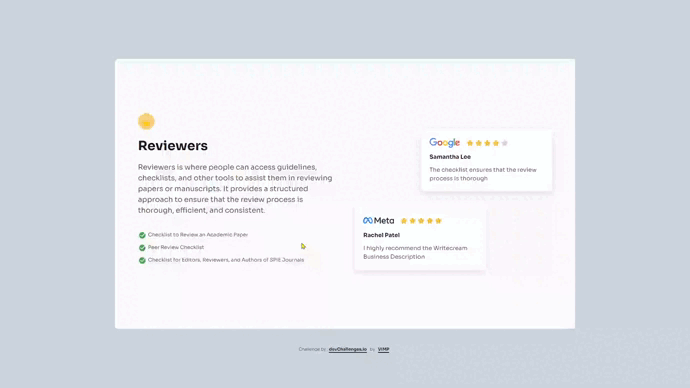

<!-- 30 Jul 2024 -->
# Testimonial Page

This challenge is to practice more advanced HTML and CSS skills. The challenge is to create a simple testimonial page that you need use grid, media queries, icons.

## *The challenges* :muscle:

🔳 Create a testimonial page that matches the given design.

🔳 Use HTML to create the basic structure.

🔳 Add heading, body text, checklists according to the design.

🔳 Add 2 testimonial cards according to the design.

🔳 Use CSS to style the card.

🔳 The page should be responsive on different screen sizes.

🔳 Deploy the solution and submit Repository URL and Demo URL.

## *Screenshot* :camera:

## *Links* :link:

[Live site URL](https://mendezpvi.github.io/dCh-testimonial-page/) 👀

[Solution in devChallenges](https://devchallenges.io/solution/29009) 👀

## *Built with* :hammer_and_pick:

✅ Semantic HTML markup

✅ CSS custom properties

✅ Utility classes

✅ Flexbox

✅ CSS Grid

## *Author* :beginner:

✨ Frontend Mentor - [@mendezpvi](https://www.frontendmentor.io/profile/mendezpvi)

✨ devChallenges.io - [@mendezpvi](https://devchallenges.io/my-solutions)